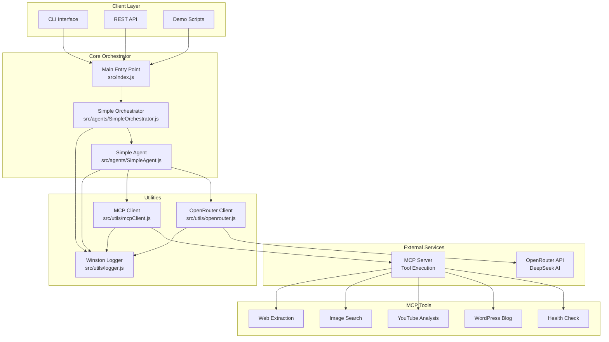
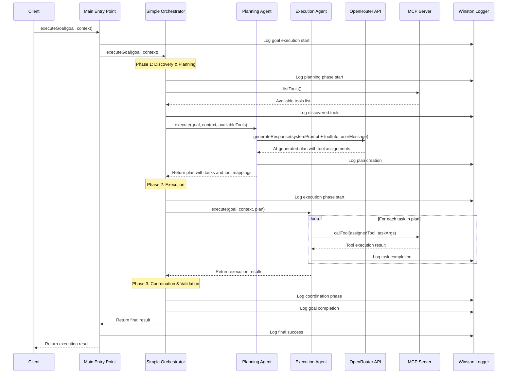
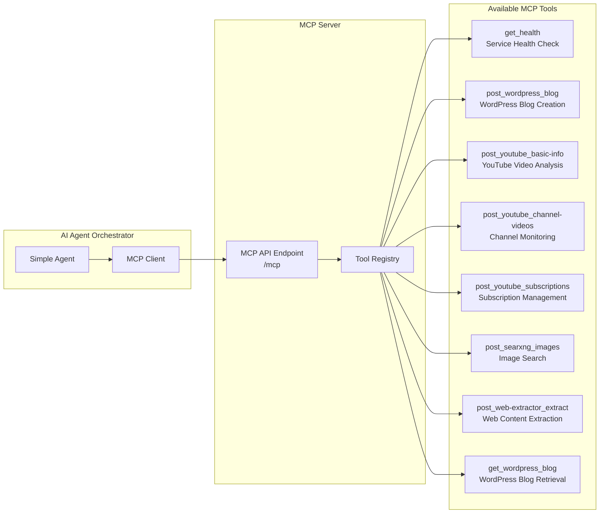
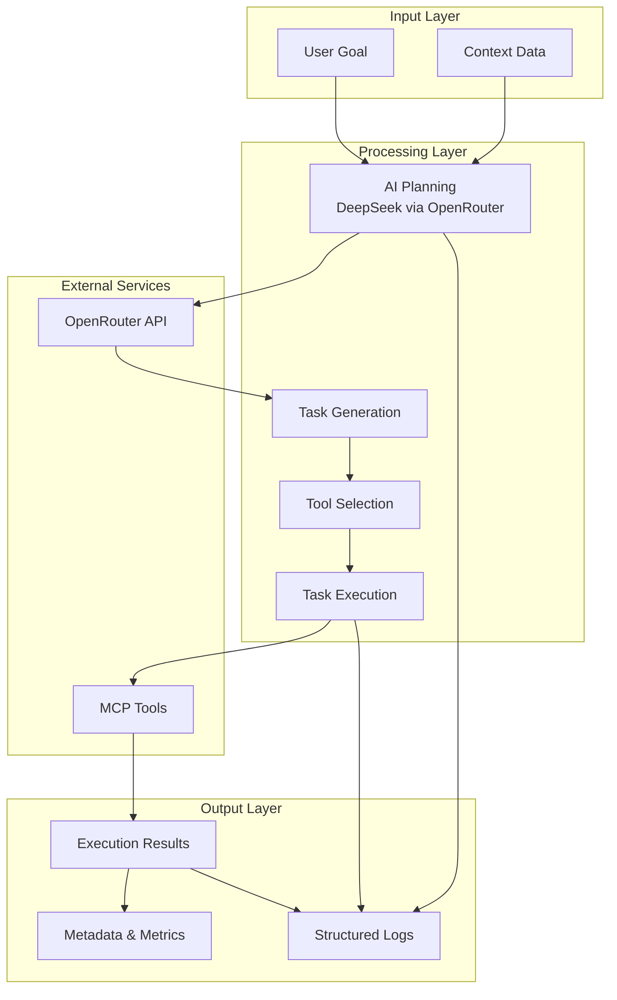
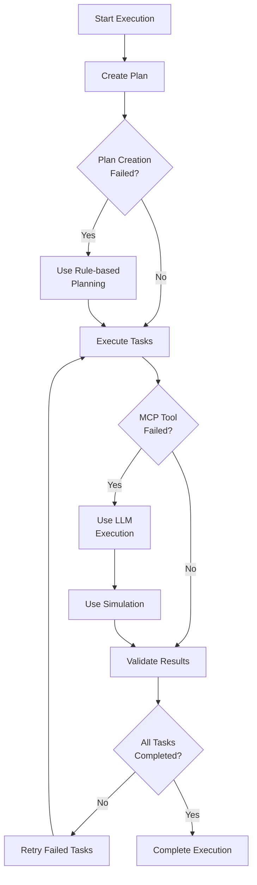

# AI Agent Orchestrator

A powerful AI agent orchestrator that combines OpenRouter (DeepSeek) and MCP (Model Context Protocol) for intelligent task planning and execution.

## Features

- 🤖 **AI-Powered Planning**: Uses DeepSeek AI via OpenRouter for intelligent task breakdown
- 🔧 **MCP Integration**: Connects to your existing MCP server for tool execution
- 🧠 **Smart Orchestration**: Coordinates multiple agents for complex workflows
- 📊 **Comprehensive Logging**: Detailed execution tracking and monitoring
- 🚀 **Easy Integration**: Simple API for executing complex goals

## Architecture Overview

### System Component Diagram



### Execution Flow Sequence Diagram



### Agent Interaction Sequence Diagram


### MCP Tool Integration Diagram



### Data Flow Diagram



### Error Handling Flow



## Quick Start

### 1. Installation

```bash
npm install
```

### 2. Configuration

Copy the environment template and configure your settings:

```bash
cp env.example .env
```

Edit `.env` with your credentials:

```ini
# OpenRouter Configuration
OPENROUTER_API_KEY=your_openrouter_api_key_here
OPENROUTER_MODEL=deepseek/deepseek-chat-v3.1:free
OPENROUTER_BASE_URL=https://openrouter.ai/api/v1

# MCP Server Configuration
MCP_SERVER_URL=http://your-mcp-server:3001

# Server Configuration
PORT=3000
MCP_PORT=3001
NODE_ENV=development
LOG_LEVEL=info
```

### 3. Run Demo

```bash
npm run demo
```

### 4. Start MCP Server

```bash
npm run mcp
```

## Usage

### Basic Usage

```javascript
import { executeGoal } from './src/index.js';

// Execute a complex goal
const result = await executeGoal('Create a comprehensive data analysis report', {
  data: { sales: [{ month: 'Jan', revenue: 10000 }] },
  requirements: { format: 'PDF' }
});

console.log('Success:', result.success);
console.log('Tasks Completed:', result.metadata.completedTasks);
```

### Advanced Usage

```javascript
import { SimpleOrchestrator } from './src/agents/SimpleOrchestrator.js';

const orchestrator = new SimpleOrchestrator({
  name: 'My Agent Orchestrator',
  capabilities: ['planning', 'execution', 'coordination']
});

const result = await orchestrator.executeGoal('Your complex goal here', {
  // Your context data
});
```

## Architecture

```
src/
├── agents/
│   ├── SimpleAgent.js      # Core agent implementation
│   └── SimpleOrchestrator.js # Agent coordination
├── utils/
│   ├── logger.js           # Logging utilities
│   ├── mcpClient.js        # MCP server client
│   └── openrouter.js       # OpenRouter API client
└── index.js                # Main entry point

api/                        # MCP server API endpoints
├── orchestrator/
│   ├── execute.js
│   └── status.js
└── agents/
    └── list.js

tests/                      # Test files
├── integration.test.js
└── ...
```

## Available MCP Tools

The orchestrator can use these MCP tools from your server:

- `get_health` - Service health check
- `post_searxng_images` - Image search
- `post_web-extractor_extract` - Web content extraction
- `get_wordpress_blog` - WordPress blog retrieval
- `post_wordpress_blog` - WordPress blog creation
- `post_youtube_basic-info` - YouTube video analysis
- `post_youtube_channel-videos` - YouTube channel monitoring
- `post_youtube_subscriptions` - YouTube subscriptions

## API Endpoints

When running the MCP server (`npm run mcp`):

- `POST /orchestrator/execute` - Execute a goal
- `GET /orchestrator/status` - Get orchestrator status
- `GET /agents/list` - List available agents

## Testing

```bash
# Run all tests
npm test

# Run tests in watch mode
npm run test:watch

# Run integration tests
node test-integration.js

# Test MCP connection
node test-mcp.js
```

## Configuration

### Environment Variables

| Variable | Description | Default |
|----------|-------------|---------|
| `OPENROUTER_API_KEY` | Your OpenRouter API key | Required |
| `OPENROUTER_MODEL` | AI model to use | `deepseek/deepseek-chat-v3.1:free` |
| `MCP_SERVER_URL` | MCP server URL | `http://localhost:3001` |
| `PORT` | Main server port | `3000` |
| `MCP_PORT` | MCP server port | `3001` |
| `LOG_LEVEL` | Logging level | `info` |

## Examples

### Data Analysis
```javascript
const result = await executeGoal('Create a comprehensive data analysis report', {
  data: {
    sales: [
      { month: 'Jan', revenue: 10000, customers: 100 },
      { month: 'Feb', revenue: 12000, customers: 120 }
    ]
  },
  requirements: {
    format: 'PDF',
    includeCharts: true,
    analysisType: 'trend'
  }
});
```

### Marketing Strategy
```javascript
const result = await executeGoal('Develop a comprehensive marketing strategy', {
  product: {
    name: 'AI Analytics Pro',
    category: 'Business Intelligence',
    targetMarket: 'SMEs'
  },
  budget: 100000,
  timeline: '6 months'
});
```

## Development

### Project Structure

- **SimpleAgent**: Core agent that handles planning and execution
- **SimpleOrchestrator**: Coordinates multiple agents and manages workflows
- **MCPClient**: Handles communication with MCP server
- **OpenRouterClient**: Manages AI model interactions

### Adding New Capabilities

1. Extend `SimpleAgent` class with new methods
2. Add new MCP tools to your server
3. Update the orchestrator to use new capabilities

## License

MIT

## Author

boqiang.liang
