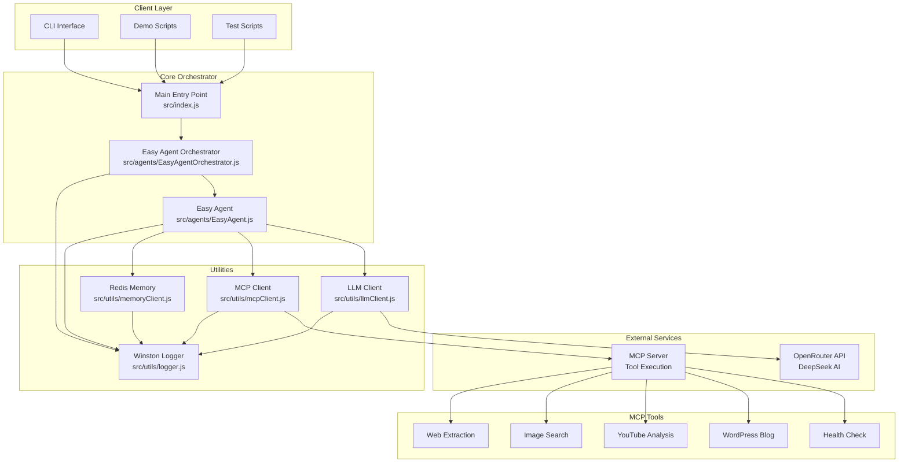
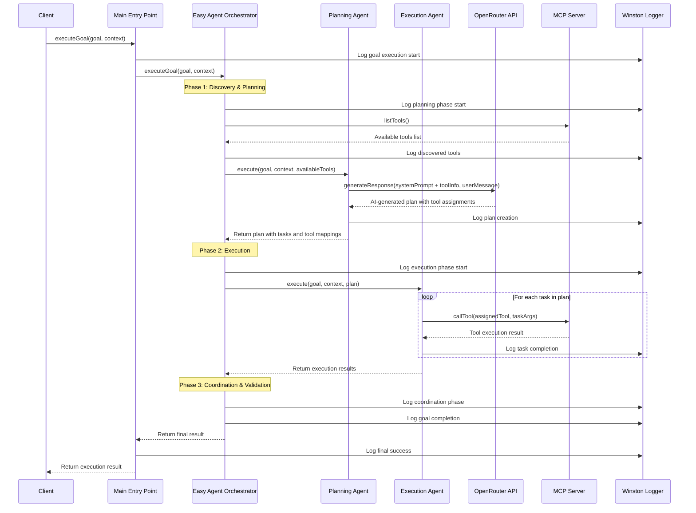
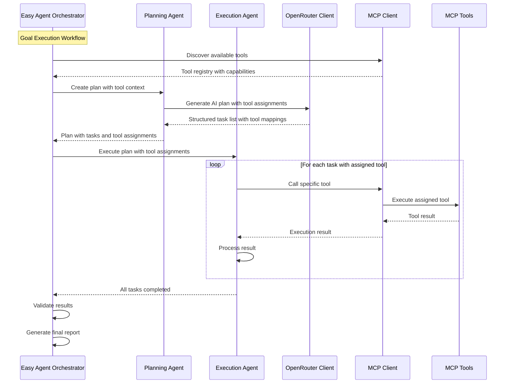
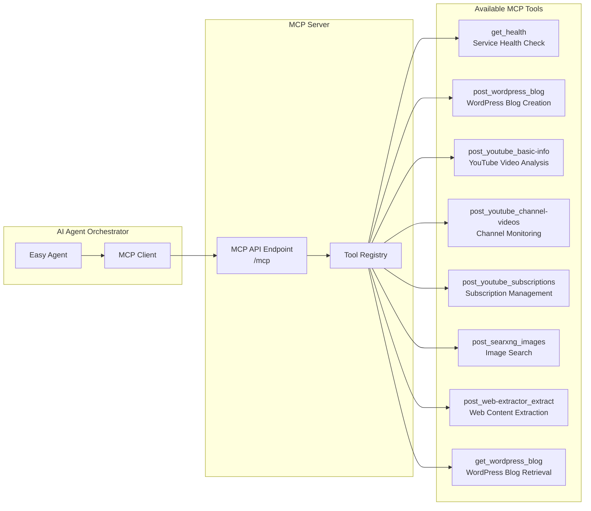
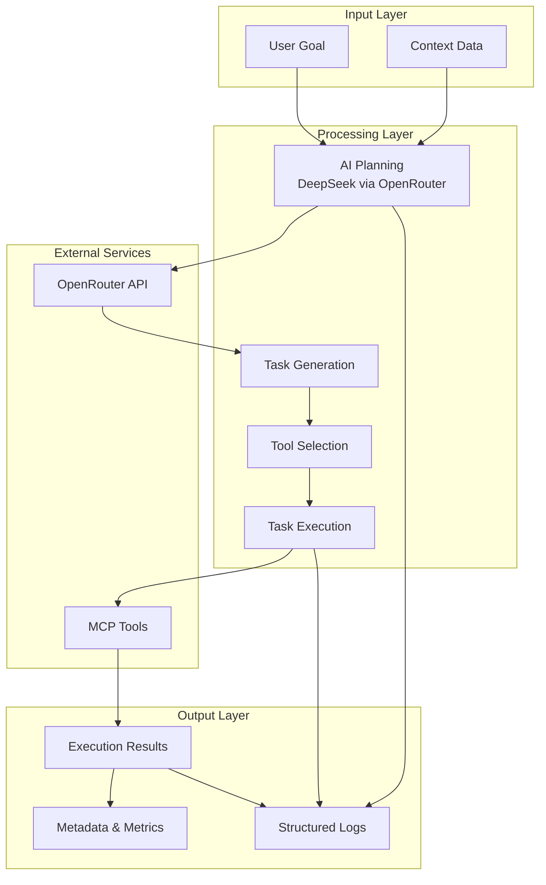
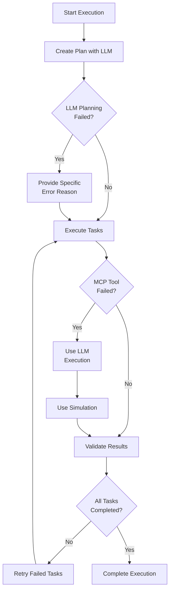

# n8n-nodes-easy-ai-agent

A professional-grade n8n node package for Easy AI Agent that combines OpenRouter (DeepSeek), Ollama, and MCP (Model Context Protocol) for enterprise-level task planning and execution with Redis memory integration and n8n workflow automation.

## Features

- 🤖 **Professional AI Planning**: Uses DeepSeek AI via OpenRouter or Ollama with enterprise-grade prompts for strategic task breakdown
- 🔧 **MCP Integration**: Connects to your existing MCP server for comprehensive tool execution
- 🧠 **Smart Orchestration**: Coordinates multiple EasyAgents for complex business workflows
- 💾 **Redis Memory**: Persistent conversation history and goal tracking with session management
- 📊 **Comprehensive Logging**: Detailed execution tracking and monitoring with Winston
- 🚀 **Easy Integration**: Simple API for executing complex goals with professional output
- 🔗 **n8n Integration**: Full n8n node package with real workflow integration and JSON schema validation
- ✅ **JSON Schema Validation**: Automatic validation of MCP tool arguments with detailed error messages
- 🛠️ **Dynamic Tool Discovery**: Automatically discovers and validates available MCP tools
- 🎯 **Enterprise Ready**: Professional prompts, business-grade deliverables, and robust error handling

## Architecture Overview

### System Component Diagram



### Execution Flow Sequence Diagram



### Agent Interaction Sequence Diagram



### MCP Tool Integration Diagram



### Data Flow Diagram



### Error Handling Flow



## Quick Start

### 1. Installation

```bash
npm install
```

### 2. Configuration

Copy the environment template and configure your settings:

```bash
cp env.example .env
```

Edit `.env` with your credentials:

```ini
# LLM Configuration
LLM_PROVIDER=ollama
LLM_MODEL=gpt-oss-80k:latest
LLM_BASE_URL=https://ollama-rtx-4070.easynet.world

# OpenRouter Configuration (Alternative)
OPENROUTER_API_KEY=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
OPENROUTER_MODEL=deepseek/deepseek-chat-v3.1:free
OPENROUTER_BASE_URL=https://openrouter.ai/api/v1

# MCP Server Configuration
MCP_SERVER_URL=http://easynet-world-7140-mcp-internaleasynetworld-service:3001

# Redis Configuration
REDIS_URL=redis://redis-service:6379
REDIS_PASSWORD=redis123456
REDIS_DB=0

# Server Configuration
NODE_ENV=development
LOG_LEVEL=info
```

### 3. Run Demo

```bash
npm run demo
```

### 4. Run Tests

```bash
npm test
```

### 5. n8n Integration

For n8n workflow automation, install the n8n node package:

```bash
cd n8n-nodes
chmod +x install.sh
./install.sh
```

The Easy Agent Orchestrator node will be available in your n8n workflow editor.

## JSON Schema Validation

The Easy Agent Orchestrator includes comprehensive JSON schema validation for MCP tools:

### Validation Features
- ✅ **Type Checking**: Ensures arguments match expected types (string, number, boolean, etc.)
- ✅ **Required Fields**: Validates that all required parameters are provided
- ✅ **Format Validation**: Checks URLs, emails, and other formatted strings
- ✅ **Range Validation**: Validates numeric ranges and string lengths
- ✅ **Enum Validation**: Ensures values match allowed options
- ✅ **Auto-sanitization**: Removes undefined values and applies defaults

### Error Messages
Instead of generic fallbacks, the system provides specific error reasons:
```
❌ LLM planning failed: Failed to parse LLM response as valid task plan. 
   Response format was invalid. Please check LLM configuration and model compatibility.

❌ Invalid arguments for tool 'post_web-extractor_extract': 
   - Required field 'url' is missing or empty
   - Field 'timeout' must be at least 1
   - Field 'selector' must be a string
```

### n8n Integration Features
- **Real Workflow Integration**: Automatically discovers and uses existing n8n LLM, Memory, and MCP nodes
- **Dynamic Tool Discovery**: Automatically discovers available MCP tools
- **Schema-Aware UI**: n8n interface shows relevant fields based on selected tools
- **Validation Integration**: Real-time validation in n8n workflow editor
- **Professional Error Handling**: Clear, actionable error messages
- **100+ Node Types**: Supports all major n8n node types (OpenAI, Anthropic, Ollama, Redis, PostgreSQL, etc.)

## Professional Features

### Enterprise-Grade Prompts

The Easy Agent Orchestrator uses professional, business-grade prompts that deliver:

- **Strategic Planning**: Senior consultant-level task breakdown with clear deliverables
- **Executive Communication**: Professional language suitable for stakeholder presentations
- **Comprehensive Analysis**: Detailed business analysis with strategic insights
- **Quality Assurance**: Rigorous validation and professional reporting standards
- **Tool Optimization**: Intelligent MCP tool selection and utilization

### Professional Output Examples

**Planning Agent Output:**
```
Conduct comprehensive data structure assessment and quality validation
Execute advanced statistical analysis and pattern recognition
Synthesize analytical findings into strategic business insights and actionable recommendations
```

**Execution Agent Output:**
```
**Executive Summary**: High-level overview of accomplishments and key outcomes
**Detailed Analysis**: Comprehensive findings with supporting evidence and methodology
**Strategic Recommendations**: Actionable next steps with clear rationale and expected impact
**Risk Assessment**: Identification of potential challenges and mitigation strategies
**Success Metrics**: Quantifiable measures of task completion and value delivered
```

## Usage

### Basic Usage

```javascript
import { executeGoal } from './src/index.js';

// Execute a complex goal
const result = await executeGoal('Create a comprehensive data analysis report', {
  data: { sales: [{ month: 'Jan', revenue: 10000 }] },
  requirements: { format: 'PDF' }
});

console.log('Success:', result.success);
console.log('Tasks Completed:', result.metadata.completedTasks);
```

### Advanced Usage

```javascript
import { EasyAgentOrchestrator } from './src/agents/EasyAgentOrchestrator.js';

const orchestrator = new EasyAgentOrchestrator({
  name: 'My Agent Orchestrator',
  capabilities: ['planning', 'execution', 'coordination']
});

const result = await orchestrator.executeGoal('Your complex goal here', {
  // Your context data
});
```

## Architecture

```
src/
├── agents/
│   ├── EasyAgent.js        # Core agent implementation
│   └── EasyAgentOrchestrator.js # Agent coordination
├── utils/
│   ├── logger.js           # Logging utilities
│   ├── llmClient.js        # LLM client (OpenRouter/Ollama)
│   ├── mcpClient.js        # MCP server client
│   └── memoryClient.js     # Redis memory client
└── index.js                # Main entry point

tests/                      # Test files
├── integration.test.js
└── ...

demo-openrouter.js          # Demonstration script
```

## Available MCP Tools

The orchestrator can use these MCP tools from your server:

- `get_health` - Service health check
- `post_searxng_images` - Image search
- `post_web-extractor_extract` - Web content extraction
- `get_wordpress_blog` - WordPress blog retrieval
- `post_wordpress_blog` - WordPress blog creation
- `post_youtube_basic-info` - YouTube video analysis
- `post_youtube_channel-videos` - YouTube channel monitoring
- `post_youtube_subscriptions` - YouTube subscriptions

## Available Scripts

- `npm start` - Run the main application
- `npm run dev` - Run in development mode with auto-reload
- `npm run demo` - Run the demonstration script
- `npm test` - Run all tests
- `npm run test:watch` - Run tests in watch mode

## Testing

```bash
# Run all tests
npm test

# Run tests in watch mode
npm run test:watch

# Run integration tests
node test-integration.js

# Test MCP connection
node test-mcp.js
```

## Configuration

### Environment Variables

| Variable | Description | Default |
|----------|-------------|---------|
| `LLM_PROVIDER` | LLM provider (ollama/openrouter) | `ollama` |
| `LLM_MODEL` | AI model to use | `gpt-oss-80k:latest` |
| `LLM_BASE_URL` | LLM base URL | `https://ollama-rtx-4070.easynet.world` |
| `OPENROUTER_API_KEY` | Your OpenRouter API key | Required for OpenRouter |
| `OPENROUTER_MODEL` | OpenRouter model | `deepseek/deepseek-chat-v3.1:free` |
| `OPENROUTER_BASE_URL` | OpenRouter base URL | `https://openrouter.ai/api/v1` |
| `MCP_SERVER_URL` | MCP server URL | `http://easynet-world-7140-mcp-internaleasynetworld-service:3001` |
| `REDIS_URL` | Redis connection URL | `redis://redis-service:6379` |
| `REDIS_PASSWORD` | Redis password | `redis123456` |
| `REDIS_DB` | Redis database number | `0` |
| `LOG_LEVEL` | Logging level | `info` |

## Examples

### Data Analysis
```javascript
const result = await executeGoal('Create a comprehensive data analysis report', {
  data: {
    sales: [
      { month: 'Jan', revenue: 10000, customers: 100 },
      { month: 'Feb', revenue: 12000, customers: 120 }
    ]
  },
  requirements: {
    format: 'PDF',
    includeCharts: true,
    analysisType: 'trend'
  }
});
```

### Marketing Strategy
```javascript
const result = await executeGoal('Develop a comprehensive marketing strategy', {
  product: {
    name: 'AI Analytics Pro',
    category: 'Business Intelligence',
    targetMarket: 'SMEs'
  },
  budget: 100000,
  timeline: '6 months'
});
```

## Development

### Project Structure

- **EasyAgent**: Core agent that handles planning and execution
- **EasyAgentOrchestrator**: Coordinates multiple agents and manages workflows
- **MCPClient**: Handles communication with MCP server
- **LLMClient**: Manages AI model interactions (OpenRouter/Ollama)
- **MemoryClient**: Handles Redis memory persistence
- **SchemaValidator**: Validates MCP tool arguments against JSON schemas

### Adding New Capabilities

1. Extend `EasyAgent` class with new methods
2. Add new MCP tools to your server
3. Update the orchestrator to use new capabilities
4. Add JSON schemas for new tools in `n8n-nodes/nodes/EasyAgentOrchestrator/schemaGenerator.ts`

## n8n Node Package

The project includes a complete n8n node package in the `n8n-nodes/` directory:

### Features
- **Complete n8n Integration**: Full TypeScript node package for n8n workflows
- **JSON Schema Validation**: Automatic validation of MCP tool arguments
- **Dynamic Tool Discovery**: Lists available MCP tools with their schemas
- **Professional UI**: Schema-aware interface with proper field validation
- **Example Workflows**: Comprehensive workflow examples demonstrating all features

### Installation
```bash
cd n8n-nodes
chmod +x install.sh
./install.sh
```

### Node Operations
- `executeGoal` - Execute complex goals with AI planning
- `getStatus` - Get orchestrator status and health
- `clearSession` - Clear memory session data
- `listTools` - Discover available MCP tools with schemas

### Example Workflow
See `n8n-nodes/examples/workflow-example.json` for a complete example that demonstrates:
- Tool discovery and validation
- Multiple LLM providers (OpenRouter, Ollama)
- Memory persistence with Redis
- Web extraction, image search, YouTube analysis, WordPress integration

## GitHub Actions & Automated Publishing

This project includes automated npm publishing using GitHub Actions and semantic-release:

### Features
- **Automated Versioning**: Uses conventional commits to determine version bumps
- **NPM Publishing**: Automatically publishes to npm registry on master branch pushes
- **Changelog Generation**: Automatically updates CHANGELOG.md
- **GitHub Releases**: Creates GitHub releases with release notes
- **Quality Gates**: Runs tests and linting before publishing

### Setup
See [GITHUB_ACTIONS_SETUP.md](GITHUB_ACTIONS_SETUP.md) for detailed setup instructions including required GitHub secrets.

## License

MIT

## Author

boqiang.liang
